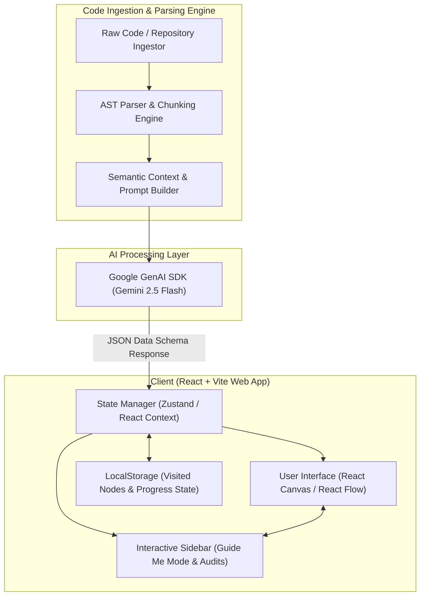

# RepoTutor: System Architecture & Specification

## 1. System Architecture

RepoTutor processes raw source code through a modular data pipeline, generating structured graph representations and semantic explanations powered by Gemini 2.5 Flash, rendered via a dynamic React visualizer interface.



### End-to-End Pipeline Stages

1. **Source Code Ingestion & Parsing**:
   - Files are loaded via file upload, repository URL input, or directory selection.
   - Client-side AST/Syntax parser extracts structural definitions (functions, classes, modules, imports/exports).
2. **Context Assembly & Prompt Generation**:
   - Relevant code snippets and structural metadata are assembled into structured prompts requesting JSON response format.
3. **Gemini 2.5 Flash Processing**:
   - Gemini API analyzes code semantics, traces call paths, generates human-readable explanations, and provides audit reports using structured JSON schemas (`responseSchema`).
4. **Dynamic Visualizer Rendering**:
   - React state receives structured nodes, edges, and execution trace steps.
   - Interactive nodes, call graphs, and step-by-step execution flows are visually presented on screen.
5. **Interactive Guidance & Persistence**:
   - **Guide Me Mode**: Step-by-step interactive walkthrough panel guides the user through the codebase flow sequentially.
   - **Visited Nodes & Progress Tracking**: Nodes and flow steps visited by the developer display a visual tick mark indicator (`✓`), with state automatically saved to `localStorage` for session persistence.

---

## 2. JSON Data Contracts

Below are the exact TypeScript interfaces and JSON schemas utilized by the Gemini GenAI SDK structured output pipeline and the React frontend state manager.

```typescript
// 1. Codebase Graph Schema
export interface GraphNode {
  id: string;
  label: string;
  type: 'function' | 'class' | 'module' | 'endpoint' | 'utility';
  filePath: string;
  startLine: number;
  endLine: number;
  summary: string;
  complexity: 'low' | 'medium' | 'high';
  tags: string[];
}

export interface GraphEdge {
  id: string;
  source: string;
  target: string;
  label: string; // e.g., "invokes", "imports", "extends", "publishes"
  type: 'sync' | 'async' | 'event' | 'dependency';
}

export interface CodebaseGraphResponse {
  repositoryName: string;
  overview: string;
  nodes: GraphNode[];
  edges: GraphEdge[];
}

// 2. Execution Flow Step Schema
export interface ExecutionStep {
  stepNumber: number;
  nodeId: string;
  title: string;
  explanation: string;
  codeSnippet: string;
  inputParams?: Record<string, string>;
  outputReturn?: string;
  sidebarNote?: string;
}

export interface ExecutionFlowTrace {
  flowId: string;
  title: string;
  description: string;
  steps: ExecutionStep[];
}

// 3. Security & Performance Audit Report Schema
export interface AuditItem {
  id: string;
  targetNodeId: string;
  category: 'security' | 'performance' | 'maintainability';
  severity: 'info' | 'low' | 'medium' | 'high' | 'critical';
  title: string;
  description: string;
  recommendation: string;
  codeSnippetRef?: string;
}

export interface AuditReportResponse {
  summary: string;
  overallScore: number; // 0 - 100
  items: AuditItem[];
}
```

---

## 3. Sprint Milestones & Scope Checklist

### Phase 1: Environment & Foundation Setup
- [ ] Initialize React + Vite project in `implementation/` directory
- [ ] Set up Tailwind CSS / Vanilla CSS design system (dark mode, glassmorphism, modern typography)
- [ ] Implement file tree reader and code syntax highlighting viewer

### Phase 2: AI Pipeline & GenAI SDK Integration
- [ ] Integrate `@google/genai` SDK with Gemini 2.5 Flash API
- [ ] Create structured output prompts with explicit JSON response schemas for:
  - Codebase Graph Generation
  - Execution Flow Semantic Tracing
  - Security & Performance Audits
- [ ] Implement robust fallback parsing & error handling for API responses

### Phase 3: Interactive Graph Visualizer
- [ ] Build interactive node graph canvas (React Flow / Custom SVG Canvas)
- [ ] Implement node selection, zooming, panning, and call graph highlights
- [ ] Connect node click events to side-by-side code editor focus

### Phase 4: Guided Mode, Visited State & LocalStorage Persistence
- [ ] Implement "Guide Me" step-by-step interactive mode in the sidebar
- [ ] Add visual tick marks (`✓`) to indicate visited nodes and completed execution steps
- [ ] Store visited state, user preferences, and active flow progress in `localStorage`
- [ ] Add progress indicator bar showing % of execution steps explored

### Phase 5: Audit Panel & Polish
- [ ] Build Security & Performance Audit tab displaying severe issues and refactoring tips linked to specific graph nodes
- [ ] Refine responsive design, micro-animations, and visual polish
- [ ] Final end-to-end verification and documentation walkthrough
